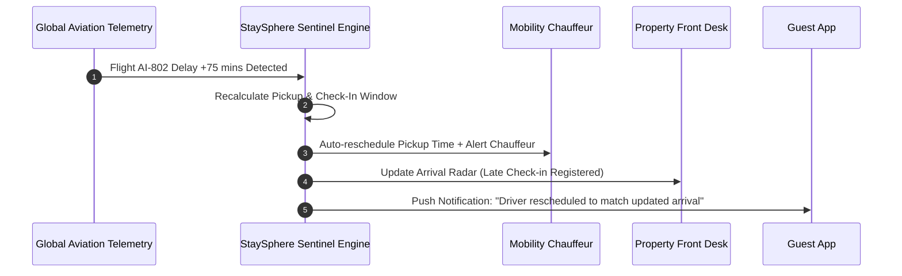
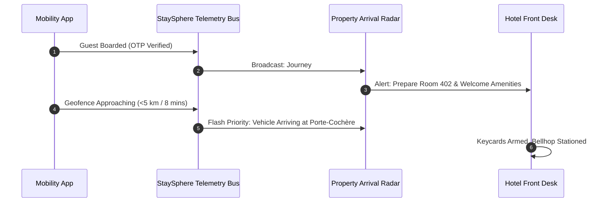

# 01. Product / Platform PRD
# STAYSPHERE
### Hospitality Marketplace & Sovereign Journey Platform
**Document Version:** 4.0  
**Company:** Cognivectra / Cybelinx  
**Product:** StaySphere  
**Category:** Hospitality Marketplace & Journey Orchestration Platform  
**Target Ecosystem:** Guests • Hotels & Resorts • Travel & Mobility Partners • Channel Partners • Operations  
**Core Brand Promise:** *Stay. Move. Experience. Resolve. We’ve Got You Covered.*  

---

## Table of Contents
1. [Executive Summary](#1-executive-summary)
2. [Strategic Positioning & HostSphere Synergy](#2-strategic-positioning--hostsphere-synergy)
3. [Vision, Mission & Core Philosophy](#3-vision-mission--core-philosophy)
4. [Ecosystem Actors & Personas](#4-ecosystem-actors--personas)
   - 4.1 [Persona Matrix](#41-persona-matrix)
   - 4.2 [Core Lifecycle User Stories](#42-core-lifecycle-user-stories)
5. [Central Domain Concept: The Sovereign Journey](#5-central-domain-concept-the-sovereign-journey)
6. [Core Functional Modules](#6-core-functional-modules)
   - 6.1 [Property Marketplace & Master Directory (STAY)](#61-property-marketplace--master-directory-stay)
   - 6.2 [Travel Desk & Mobility Marketplace (MOVE)](#62-travel-desk--mobility-marketplace-move)
   - 6.3 [Bespoke Excursions Marketplace (EXPERIENCE)](#63-bespoke-excursions-marketplace-experience)
   - 6.4 [Resolution Desk & SLA Engine (RESOLVE)](#64-resolution-desk--sla-engine-resolve)
   - 6.5 [Operations Control Tower & 360° Feedback](#65-operations-control-tower--360-feedback)
   - 6.6 [Trust, Safety & Marketplace Ranking](#66-trust-safety--marketplace-ranking)
   - 6.7 [Finance, Milestone Escrow & Settlement Engine](#67-finance-milestone-escrow--settlement-engine)
   - 6.8 [Offer Management Engine (Season-Based)](#68-offer-management-engine-season-based)
7. [Cross-Party Synchronization Protocols](#7-cross-party-synchronization-protocols)
   - 7.1 [Flight Telemetry & Delay Cascade](#71-flight-telemetry--delay-cascade)
   - 7.2 [Arrival Radar Handshake (Mobility ↔ Property)](#72-arrival-radar-handshake-mobility--property)
   - 7.3 [Cascading & Partial Cancellations](#73-cascading--partial-cancellations)
8. [Metrics & Key Performance Indicators](#8-metrics--key-performance-indicators)
9. [Policy & Manual Cross-References](#9-policy--manual-cross-references)

---

## 1. Executive Summary

**StaySphere** is a multi-party hospitality journey orchestration platform connecting **Guests, Property Partners, and Mobility Partners** through a unified, trusted journey, while **StaySphere Operations** manages commercial, financial, operational, quality, and resolution workflows across the entire lifecycle.

StaySphere is not designed to replace a hotel's internal Property Management System (PMS), nor is it simply another standard Online Travel Agency (OTA). Rather, it redefines the hospitality experience by managing the complete guest journey lifecycle:
```
Better Booking + Coupled Coordination + Better In-Stay Service + Proactive 15-Min Resolution
```

### Core Value Proposition by Participant
* **Guest / Customer:** Discover and book verified accommodations coupled with flight-synchronized airport transfers, curated excursions, digital NFC room keys, and a guaranteed 15-minute resolution SLA.
* **Property Partner:** Monetize inventory, maintain strict rate parity, streamline guest arrivals via the live Arrival Radar, automate payouts within 2 hours of check-in, and eliminate blind front desk queues.
* **Mobility Partner:** Access predictable travel demand, execute flight-synced chauffeur dispatches, verify passenger pickups via OTP, and receive automated milestone escrow disbursements upon trip completion.
* **Channel Partner (B2B):** Execute atomic 3-in-1 bookings (Stay + Transit + Tour) via REST APIs with guaranteed 12%–15% commission settlement.
* **StaySphere Operations (Control Tower):** Act as the sovereign orchestrator of the end-to-end journey, enforcing milestone-based escrow releases, proactive Sentinel health monitoring, and guaranteed 15-minute issue resolution.

---

## 2. Strategic Positioning & HostSphere Synergy

Cybelinx maintains a dual-product hospitality ecosystem where **HostSphere** and **StaySphere** serve complementary, non-overlapping functions:

```
┌─────────────────────────────────────────────────────────┐
│                        CYBELINX                         │
└────────────────────────────┬────────────────────────────┘
                             │
        ┌────────────────────┴────────────────────┐
        ▼                                         ▼
┌───────────────────────────┐         ┌───────────────────────────┐
│        HOSTSPHERE         │         │        STAYSPHERE         │
│  B2B Operations Platform  │         │ B2C/B2B2C Journey Market  │
│  "Run your property"      │         │ "Own your journey"        │
└───────────────────────────┘         └───────────────────────────┘
```

| Dimension | HostSphere (B2B) | StaySphere (B2C / B2B2C) |
| :--- | :--- | :--- |
| **Primary Audience** | Hotel Operators & Internal Staff | Guests, Hotels, Mobility & Channel Partners |
| **Strategic Focus** | Internal Property Operations | Complete Customer Journey Lifecycle |
| **Core Mantra** | *"Run your property."* | *"Own your journey."* |
| **Reservations** | Manages room allocations & folio billing | Acquires demand & facilitates multi-party booking |
| **Transportation** | Non-core / External | **Core first-class module (Travel Desk)** |
| **Channel Partners** | Non-core | **Core acquisition & distribution engine** |
| **Issue Resolution** | Internal department ticketing | **Cross-party SLA-driven Resolution Desk** |
| **Financial Settlement** | Operational ledger & folio billing | **Multi-vendor milestone escrow engine** |

---

## 3. Vision, Mission & Core Philosophy

### Vision
> *To become the world's most trusted sovereign journey platform — seamlessly coupling luxury stays, executive mobility, and curated experiences with proactive resolution.*

### Mission
> *To make luxury travel transactions and journeys effortless, transparent, responsive, and mutually rewarding for every guest, property operator, driver, and channel partner.*

### Core Architectural Philosophy
> **"The Booking Is Not The End."**  
A booking is merely the commencement of a multi-party operational contract. StaySphere actively orchestrates the physical execution of the journey from flight departure to departure transfer.

---

## 4. Ecosystem Actors & Personas

### 4.1 Persona Matrix

| Persona | Primary Application | Primary Goal | Core Responsibilities Across Lifecycle |
| :--- | :--- | :--- | :--- |
| **Guest / Customer** | `StaySphere Guest Web & Mobile` | Discover and complete a seamless, protected journey | Search, customize, book, pay upfront, sync flight telemetry, transit, check-in, enjoy in-stay services, resolve issues, submit feedback. |
| **Property Partner** | `StaySphere Property Portal` | Monetize verified property inventory at fair yield | Register KYC, publish inventory & room tiers, manage rates & parity, monitor the **Arrival Radar**, host guests, fulfil in-stay requests, receive milestone payouts. |
| **Mobility Partner** | `StaySphere Mobility Portal` | Maximize fleet utilization & transit yields | Register vehicles & chauffeurs, accept dispatch assignments, sync flight arrivals, execute OTP-verified pickup/drop, conduct tours, receive escrow disbursements. |
| **StaySphere Operations** | `StaySphere Control Tower` | Orchestrate, protect, govern, and settle journeys | Flight/transit radar monitoring, pricing, split billing, commission retention, milestone escrow releases, SLA enforcement (<15 min), Sentinel alerts, support resolution, 360° trust scoring. |
| **Channel Partner (Secondary)** | `StaySphere Channel Desk / B2B API` | Distribute bundled high-margin travel packages | Search bundled inventory, execute atomic 3-in-1 bookings, receive contractual commission margins (12%–15%), manage client itineraries. |

---

### 4.2 Core Lifecycle User Stories

#### Story 1: Customer (Guest)
> **As a Customer**, I want to discover verified accommodations in my target destination and construct a unified **Journey** (bundling room reservations, flight-synchronized airport transfers, and curated excursions), so that I can pay once, track my entire itinerary in real time, and enjoy guaranteed in-stay and transit support without juggling multiple disconnected apps.

*Acceptance Criteria:*
1. Ability to search by location, dates, guest count, and lifestyle filters.
2. Option to couple room booking with Airport Pickup/Drop and bespoke Sightseeing in one checkout session.
3. Automated flight number binding with real-time flight status tracking.
4. Unified itinerary dashboard (`My Journey`) displaying journey health (Green / Yellow / Red), driver details, room status, and digital keys.
5. In-stay service ordering (housekeeping, dining, late checkout) and 1-tap **Resolve** ticket initiation.
6. Post-journey 360° rating for both Property and Chauffeur.

#### Story 2: Property Partner
> **As a Property Partner**, I want to register, verify my property, advertise available rooms, synchronize rates, and view upcoming guest transit via the **Arrival Radar**, so that my front desk can prepare rooms ahead of physical arrival, host guests smoothly, and receive automated milestone payouts within 2 hours of check-in.

*Acceptance Criteria:*
1. Tiered self-service onboarding with business registration, PAN/GST, and property quality inspection.
2. Real-time room inventory management, rate plan configuration, and calendar synchronization (via native HostSphere bridge or external PMS iCal/API).
3. **Arrival Radar view** showing guest arrival status: Flight Landed $\rightarrow$ Chauffeur En Route $\rightarrow$ ETA to Hotel Lobby.
4. Guest check-in confirmation trigger that unlocks the Milestone Escrow payout.
5. Direct incident response interface for in-stay guest tickets and guest rating/review submission.

#### Story 3: Mobility / Transport Partner
> **As a Transport Partner**, I want to register my fleet and certified chauffeurs, accept dispatch assignments tied to guest room bookings, and execute flight-synchronized trips, so that my drivers arrive exactly when guests land, trips are completed securely with OTP verification, and earnings are settled directly to my escrow account upon trip completion.

*Acceptance Criteria:*
1. Onboarding of vehicles (sedans, SUVs, luxury vans) and chauffeurs with document verification (driving license, commercial permits, background check).
2. Automated trip dispatch tied to Guest Flight Number with dynamic pickup time recalculation in case of airline delays.
3. Driver interface for `En Route` $\rightarrow$ `Arrived at Curb` $\rightarrow$ `Passenger Picked Up (OTP)` $\rightarrow$ `Trip Completed`.
4. Automated trip completion trigger notifying StaySphere Escrow to release mobility fare within 2 hours.
5. Incident reporting (vehicle breakdown, passenger no-show) with immediate dispatch of backup fleet via Control Tower.

#### Story 4: StaySphere Platform Operations (Control Tower)
> **As a Platform Operator**, I want an all-seeing **Control Tower** that monitors multi-party telemetry, orchestrates milestone-based escrow releases, automatically detects operational anomalies via **Sentinel Alerts**, and enforces our 15-minute resolution SLA, so that guests, properties, and mobility partners experience zero friction, fair billing, and transparent trust governance.

*Acceptance Criteria:*
1. Real-time telemetry map showing active Journeys, in-flight guests, en-route chauffeurs, and active stays.
2. Automated **Sentinel Alert Engine** triggering proactive warnings (e.g., driver stationary 30 mins before pickup, unconfirmed check-in 45 mins post-arrival).
3. **Escrow Ledger Engine**: holds customer funds upfront, executes automated split settlements (Mobility: 2 hrs post-trip; Hotel: 2 hrs post-check-in), deducts StaySphere commission, and manages refund/clawback reserves.
4. Cross-Party Collaborative Ticket Intercom connecting Guest, Hotel GM, Fleet Lead, and Operator with a guaranteed 15-minute resolution countdown.
5. **360° Reputation Engine** computing normalized Trust Scores for Guests, Hotels, and Chauffeurs to influence marketplace placement and platform privileges.

---

## 5. Central Domain Concept: The Sovereign Journey

In StaySphere, **`Journey` is the Aggregate Root**. A booking is merely a child component within an active Journey lifecycle.

```text
Account
  │
  └── GuestProfile
        │
        └── Journey (Root Aggregate)
              ├── HotelBooking (STAY)
              ├── TravelBooking / MobilityLegs (MOVE)
              ├── ExperienceBooking (EXPERIENCE)
              ├── ServiceRequests (IN-STAY)
              ├── ResolutionTickets (RESOLVE)
              ├── PaymentEscrowLedger (FINANCE)
              ├── JourneyTelemetry (RADAR & GPS)
              └── 360Feedback (REPUTATION)
```

### The 8 Lifecycle Phases:
1. **Discover:** Guest evaluates verified properties, transfers, and activities.
2. **Book & Escrow:** Atomic payment captured; funds allocated to Escrow Ledger.
3. **Prepare:** Flight details confirmed, chauffeur assigned, hotel pre-arrival folio created.
4. **Transit (Inbound):** Chauffeur picks up guest; live ETA pushed to hotel Arrival Radar.
5. **Check-In & Stay:** Guest checks in (NFC/front desk); Milestone 1 released to Hotel; in-stay services live.
6. **Experience & Transit (Sightseeing):** Excursions and intra-city mobility executed with OTP.
7. **Check-Out & Transit (Outbound):** Final folio settled; airport drop executed; Milestone 2 released.
8. **Resolve & Feedback:** 360° multi-party reviews submitted; final escrow reconciliation.

---

## 6. Core Functional Modules

```
                     STAYSPHERE JOURNEY ECOSYSTEM
 ┌─────────────────┬─────────────────┬─────────────────┬─────────────────┐
 │      STAY       │      MOVE       │   EXPERIENCE    │     RESOLVE     │
 ├─────────────────┼─────────────────┼─────────────────┼─────────────────┤
 │ Boutique Hotels │ Executive Cars  │ Speedboats      │ 15-Min SLA      │
 │ Luxury Resorts  │ 4x4 Mountain    │ Solar Boats     │ Auto-Escrow     │
 │ Clifftop Villas │ Airport Radar   │ Heritage Tours  │ RM Intercom     │
 │ Serviced Suites │ Zero-Delay GPS  │ Snow Safaris    │ Sentinel Alert  │
 └─────────────────┴─────────────────┴─────────────────┴─────────────────┘
```

### 6.1 Property Marketplace & Master Directory (STAY)
* **Master Directory:** Rich media, virtual tours, room categorization, amenity tagging, and sustainability scores.
* **Inventory & Parity Engine:** Real-time sync with HostSphere PMS and third-party channel managers. Soft-blocks any rates violating contracted parity floors.
* **Guest Arrival Radar:** Real-time inbound radar displaying guest flight status, assigned chauffeur, and live road ETA directly on the Property front desk terminal.
* **Digital Check-in Bridge:** Integrates with PMS to pre-allocate rooms, generate digital keys (NFC/QR), and verify guest identity.

### 6.2 Travel Desk & Mobility Marketplace (MOVE)
* **Fleet Catalog:** Luxury sedans, electric executive SUVs, premium mountain 4x4s, and luxury vans with verified capacity rules (seats vs. luggage pieces).
* **Flight-Synced Dispatch:** Dynamic integration with global aviation tracking (ADS-B / AviationStack). Automatically shifts driver dispatch times if flights are delayed or arrive early.
* **OTP Handshake Verification:** Cryptographic 4-digit OTP shared between Guest and Chauffeur at curbside to prevent misidentification and validate trip initiation.
* **Dynamic Geofencing & Telemetry:** GPS pings streamed to StaySphere Event Bus every 5 seconds to track transit safety and update Arrival Radar.

### 6.3 Bespoke Excursions Marketplace (EXPERIENCE)
* **Curated Activities:** Private yacht charters, vineyard tastings, helicopter transfers, guided heritage walks.
* **Time-Slot Scheduling:** Conflict-free itinerary scheduling preventing overlapping excursions with hotel meals or mobility transfers.
* **Operator Handshake:** Mobile-friendly partner app for tour guides to scan booking QR codes and log completion.

### 6.4 Resolution Desk & SLA Engine (RESOLVE)
* **15-Minute Guaranteed SLA:** Operational countdown timer for all P0/P1 incidents.
* **Automated Goodwill Credit:** Automated dispatch of compensatory credit (e.g., ₹3,000 / $50) if SLA is breached at 15:01.
* **Collaborative Ticket Intercom:** Multi-party encrypted chat room linking Guest, Hotel GM, Fleet Lead, and Control Tower Relationship Manager (RM).
* **Sovereign Recovery Dispatch:** Auto-triggers standby replacement vehicle or emergency room re-allocation from the sovereign reserve pool if a partner defaults.

### 6.5 Operations Control Tower & 360° Feedback
* **Mission Control Dashboard:** Macro-level visibility of global journey health, regional flight delays, and active room occupancies.
* **Sentinel Alert Monitor:** Proactive alert surface highlighting journeys in `YELLOW` (at risk) or `RED` (critical disruption) status.
* **360° Feedback Engine:** Post-stay multi-party rating system:
  - *Guest rates:* Hotel (amenities, cleanliness, staff) and Chauffeur (punctuality, driving quality, vehicle hygiene).
  - *Hotel rates:* Guest (conduct, property care).
  - *Chauffeur rates:* Guest (punctuality, courtesy).

### 6.6 Trust, Safety & Marketplace Ranking
* **Partner Verification Tiers:**
  - `REGISTERED`: Initial onboarding, basic document verification.
  - `VERIFIED`: Passed physical inspection, verified banking credentials, background-checked staff.
  - `PREMIER`: Minimum 50 journeys completed, $\ge 98.0\%$ Trust Score, zero unresolved P0 incidents.
* **Dynamic Marketplace Ranking:** Search algorithms prioritize partners with high SLA compliance, zero no-shows, and rapid response times.

### 6.7 Finance, Milestone Escrow & Settlement Engine
* **Single Checkout Splitting:** Single payment processed from Guest; backend atomically divides amounts into Property Payable, Mobility Payable, Experience Payable, Platform Commission, and Tax Withholding.
* **Milestone Disbursement Rules:**
  - *Mobility:* Released 2 hours after verified OTP trip completion.
  - *Property:* 70% base released 2 hours after verified guest check-in; remaining 30% released 24 hours post-checkout after room clearance.
* **Clawback & Dispute Hold:** Control Tower has the authority to freeze escrow disbursements on any partner facing active P0 investigation.

### 6.8 Offer Management Engine (Season-Based)
* **Demand Season Calendar:** Platform defines `PEAK`, `OFF-PEAK`, and `SHOULDER` periods across geographic zones.
* **Rules & Guardrails:**
  - *Peak:* Only complimentary add-ons permitted (transfers, breakfast, spa credit) to protect average daily rates (ADR).
  - *Off-Peak:* Percentage discounts, Stay-X-Pay-Y, and Flash Deals permitted.
  - *Rate Parity Guard:* Soft-blocks partner offers violating contracted minimum thresholds.
* Full policy reference: [13_OFFER_MANAGEMENT_POLICY.md](./13_OFFER_MANAGEMENT_POLICY.md)

---

## 7. Cross-Party Synchronization Protocols

### 7.1 Flight Telemetry & Delay Cascade


### 7.2 Arrival Radar Handshake (Mobility ↔ Property)


### 7.3 Cascading & Partial Cancellations
* **Stay Cancellation:** If Guest cancels Hotel $\ge 48$ hrs prior, system prompts: *"Would you also like to cancel your airport transfer and scheduled tours?"* If confirmed, the entire bundle cancels atomically with zero fee.
* **Driver Breakdown / Abandonment:** If Chauffeur cancels $<2$ hours prior, Sentinel automatically dispatches an emergency Tier-1 backup vehicle from the sovereign fleet pool without requiring guest intervention.

---

## 8. Metrics & Key Performance Indicators

- **Successful Journey Rate (SJR):** $\ge 97.5\%$
- **Average SLA Resolution Time:** $<15.0$ minutes
- **P0 Critical Incident Rate:** $<0.5\%$ of active journeys
- **Property Partner Trust Score:** $\ge 98.0\%$
- **Chauffeur On-Time Dispatch Rate:** $\ge 99.0\%$
- **Escrow Settlement Accuracy:** $100.0\%$ with zero manual reconciliation errors

---

## 9. Policy & Manual Cross-References

| Document Code | Document Title | Primary Purpose |
| :--- | :--- | :--- |
| **[02_GUEST_EXPERIENCE_MANUAL.md](./02_GUEST_EXPERIENCE_MANUAL.md)** | Guest Experience Manual | Customer navigation, journey booking, and in-stay service guide. |
| **[03_PROPERTY_PARTNER_MANUAL.md](./03_PROPERTY_PARTNER_MANUAL.md)** | Property Partner Manual | Hotel onboarding, inventory sync, Arrival Radar, and payout rules. |
| **[04_TRAVEL_MOBILITY_PARTNER_MANUAL.md](./04_TRAVEL_MOBILITY_PARTNER_MANUAL.md)** | Travel & Mobility Manual | Chauffeur onboarding, flight telemetry sync, OTP trips, and fleet rules. |
| **[08_CONTROL_TOWER_OPERATIONS_MANUAL.md](./08_CONTROL_TOWER_OPERATIONS_MANUAL.md)** | Control Tower Operations Manual | Operator playbooks, Sentinel incident triage, and escrow management. |
| **[10_COMMERCIAL_COMMISSION_POLICY.md](./10_COMMERCIAL_COMMISSION_POLICY.md)** | Commercial & Commission Policy | Platform commission tiers, payout schedules, and tax withholding. |
| **[12_SLA_RESOLUTION_POLICY.md](./12_SLA_RESOLUTION_POLICY.md)** | SLA & Resolution Policy | 15-minute guarantee, severity tiers, and breach compensation rules. |
| **[13_OFFER_MANAGEMENT_POLICY.md](./13_OFFER_MANAGEMENT_POLICY.md)** | Offer Management Policy | Seasonal offer governance, rate parity floors, and approval queues. |
| **[14_TECHNICAL_REQUIREMENTS_SPECIFICATION.md](./14_TECHNICAL_REQUIREMENTS_SPECIFICATION.md)** | Technical Requirements Specification | System architecture, entity models, FSMs, APIs, and security specs. |
