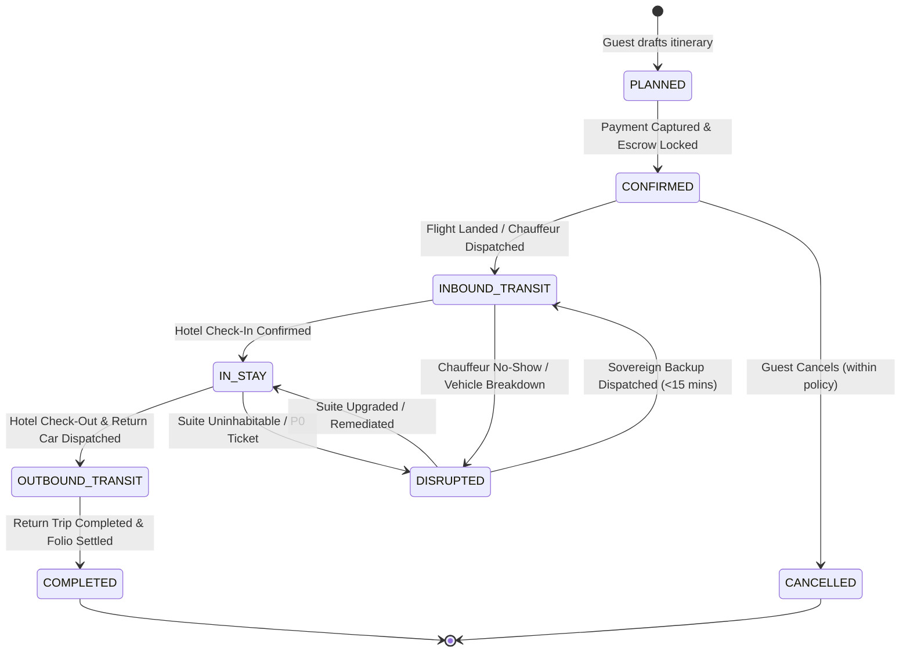
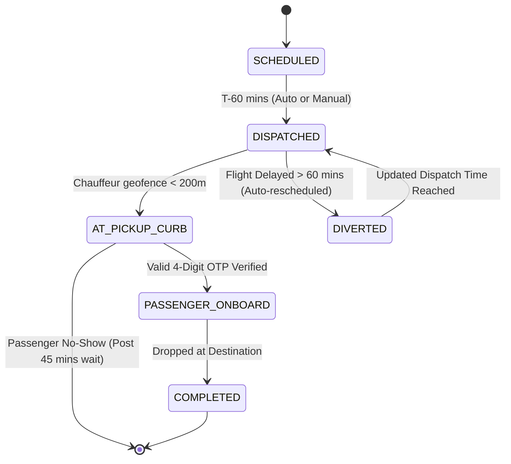
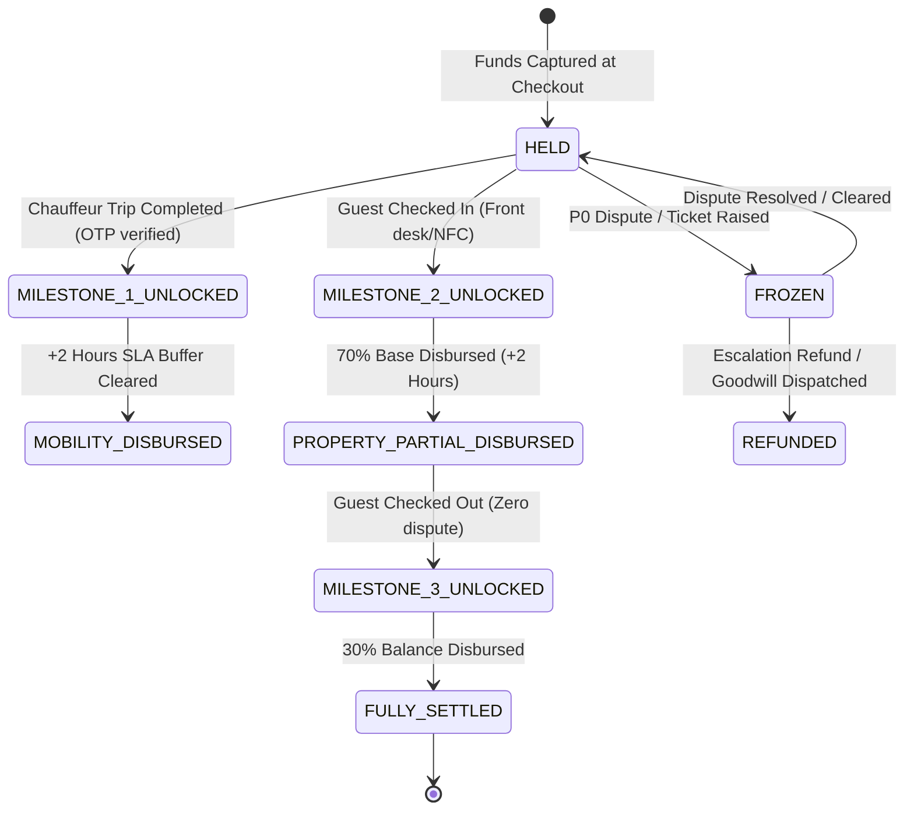

# 14. Technical Requirements Specification (TRS)
# STAYSPHERE
### Multi-Party Hospitality Journey Orchestration Engine
**Document Version:** 1.0  
**Status:** Approved Technical Baseline  
**Target Applications:** `web-guest` • `web-property` • `web-mobility` • `web-control-tower` • `core-services`  
**Cross-Reference:** [01_PRODUCT_PLATFORM_PRD.md](./01_PRODUCT_PLATFORM_PRD.md) • [12_SLA_RESOLUTION_POLICY.md](./12_SLA_RESOLUTION_POLICY.md) • [10_COMMERCIAL_COMMISSION_POLICY.md](./10_COMMERCIAL_COMMISSION_POLICY.md)

---

## 1. Executive Technical Summary

StaySphere is an event-driven, multi-party journey orchestration platform. The system operates on the core invariant: **"The Booking Is Not The End."** 

Unlike traditional travel distribution systems that stop at voucher confirmation, StaySphere orchestrates real-time state synchronization, telemetry tracking, milestone-based multi-vendor escrow disbursement, and proactive automated resolution across four primary applications:
1. **StaySphere Guest Web/App** (`web-guest`): Discover, assemble, pay, monitor, and resolve journeys.
2. **StaySphere Property Portal** (`web-property`): Inventory management, rate parity, and real-time **Arrival Radar**.
3. **StaySphere Mobility Portal** (`web-mobility`): Fleet scheduling, flight-synced chauffeur dispatch, and OTP trip fulfillment.
4. **StaySphere Control Tower** (`web-control-tower`): Unified operational command, Sentinel telemetry radar, milestone escrow governance, and collaborative SLA resolution.

---

## 2. System Architecture & Topology

```
                                  CLIENT TIER
  ┌─────────────────┐   ┌─────────────────┐   ┌─────────────────┐   ┌─────────────────┐
  │   web-guest     │   │  web-property   │   │  web-mobility   │   │web-control-tower│
  │  (Guest App)    │   │ (Hotel Portal)  │   │(Chauffeur Desk) │   │ (Mission Ops)   │
  └────────┬────────┘   └────────┬────────┘   └────────┬────────┘   └────────┬────────┘
           │                     │                     │                     │
           └─────────────────────┼─────────────────────┼─────────────────────┘
                                 ▼
                     ┌───────────────────────┐
                     │   API Gateway & Auth  │
                     │  (JWT / RBAC / Rate)  │
                     └───────────┬───────────┘
                                 │
     ┌───────────────────────────┼───────────────────────────┐
     ▼                           ▼                           ▼
┌──────────────┐          ┌──────────────┐          ┌──────────────┐
│   Journey    │          │   Mobility   │          │   Property   │
│ Orchestrator │          │   Dispatch   │          │  Inventory   │
└──────┬───────┘          └──────┬───────┘          └──────┬───────┘
       │                         │                         │
       └─────────────────────────┼─────────────────────────┘
                                 ▼
                    ┌─────────────────────────┐
                    │     EVENT BUS / SSE     │
                    │ (Kafka / Redis Streams) │
                    └────────────┬────────────┘
                                 │
     ┌───────────────────────────┼───────────────────────────┐
     ▼                           ▼                           ▼
┌──────────────┐          ┌──────────────┐          ┌──────────────┐
│   Aviation   │          │   Sentinel   │          │   Milestone  │
│  Telemetry   │          │ Alert Engine │          │ Escrow Ledger│
└──────────────┘          └──────────────┘          └──────────────┘
```

### Component Responsibilities:
- **API Gateway & Auth:** Validates JWT claims, enforces Role-Based Access Control (`GUEST`, `PROPERTY_OPERATOR`, `CHAUFFEUR`, `OPS_DISPATCHER`), and throttles rate limits.
- **Journey Orchestrator:** Manages the lifecycle of the `Journey` root aggregate, coordinating child bookings across properties and mobility fleets.
- **Aviation Telemetry Adapter:** Ingests live ADS-B flight feeds, calculates arrival drift, and emits delay events.
- **Sentinel Alert Engine:** Continuously runs deterministic rules over active journey events to detect operational risks before they impact guests.
- **Milestone Escrow Ledger:** Double-entry accounting system that locks customer funds upon booking and disburses split payouts upon verified physical milestone events.

---

## 3. Domain Data Models & Schemas

### 3.1 Journey Aggregate Root (`Journey`)
The `Journey` entity is the sovereign root for all customer interactions:

```typescript
export interface Journey {
  journeyId: string; // e.g., "JRN-8942-DXB"
  guestId: string;
  status: JourneyStatus;
  destination: {
    city: string;
    country: string;
    coordinates: [number, number];
  };
  timeline: {
    startDate: string; // ISO 8601
    endDate: string;   // ISO 8601
  };
  legs: {
    hotelBookingIds: string[];
    mobilityLegIds: string[];
    experienceBookingIds: string[];
  };
  escrowId: string;
  health: 'GREEN' | 'YELLOW' | 'RED';
  activeAlerts: string[]; // references SentinelAlert IDs
  createdAt: string;
  updatedAt: string;
}

export type JourneyStatus =
  | 'PLANNED'
  | 'CONFIRMED'
  | 'INBOUND_TRANSIT'
  | 'IN_STAY'
  | 'OUTBOUND_TRANSIT'
  | 'COMPLETED'
  | 'CANCELLED'
  | 'DISRUPTED';
```

### 3.2 Property & Hotel Booking Entity (`HotelBooking`)
```typescript
export interface HotelBooking {
  bookingId: string; // e.g., "HB-7721"
  journeyId: string;
  propertyId: string;
  roomTypeId: string;
  roomNumber?: string;
  checkInDate: string;  // "2026-09-12T15:00:00Z"
  checkOutDate: string; // "2026-09-16T11:00:00Z"
  guestDetails: {
    primaryName: string;
    contactPhone: string;
    guestCount: number;
    specialRequests?: string[];
  };
  arrivalRadarStatus: 'FLIGHT_AIRBORNE' | 'CHAUFFEUR_EN_ROUTE' | 'AT_PORTE_COCHERE' | 'CHECKED_IN';
  roomReadiness: 'CLEANING' | 'INSPECTED' | 'KEY_ASSIGNED';
  nfcKeyPassId?: string;
  rateDetails: {
    baseRatePerNight: number;
    totalNights: number;
    taxes: number;
    netPropertyPayable: number;
    platformCommission: number;
    currency: string;
  };
  lifecycleState: 'CONFIRMED' | 'CHECKED_IN' | 'CHECKED_OUT' | 'NO_SHOW' | 'CANCELLED';
}
```

### 3.3 Mobility Leg Entity (`MobilityLeg`)
```typescript
export interface MobilityLeg {
  mobilityId: string; // e.g., "MOB-4091"
  journeyId: string;
  type: 'AIRPORT_PICKUP' | 'AIRPORT_DROP' | 'INTERCITY' | 'SIGHTSEEING';
  assignedFleetPartnerId: string;
  assignedVehicleId?: string;
  assignedChauffeurId?: string;
  flightTelemetry?: {
    flightNumber: string; // e.g., "EK-512"
    airline: string;
    originalScheduledArrival: string;
    currentEstimatedArrival: string;
    terminal: string;
    delayMinutes: number;
  };
  pickupCoordinates: [number, number];
  dropoffCoordinates: [number, number];
  pickupTime: string;
  verificationOtp: string; // 4-digit code required to start trip
  telemetry: {
    chauffeurLiveCoords?: [number, number];
    lastPingTimestamp?: string;
    etaMinutesToDropoff?: number;
  };
  fareDetails: {
    baseFare: number;
    tollsAndParking: number;
    netDriverPayable: number;
    platformCommission: number;
  };
  status:
    | 'SCHEDULED'
    | 'DISPATCHED'
    | 'AT_PICKUP_CURB'
    | 'PASSENGER_ONBOARD'
    | 'COMPLETED'
    | 'CANCELLED'
    | 'DIVERTED';
}
```

### 3.4 Payment & Milestone Escrow Ledger (`PaymentEscrowLedger`)
```typescript
export interface PaymentEscrowLedger {
  escrowId: string; // e.g., "ESC-99201"
  journeyId: string;
  totalCapturedAmount: number;
  currency: string;
  paymentGatewayRef: string;
  capturedAt: string;
  splits: {
    propertyShareTotal: number;
    mobilityShareTotal: number;
    experienceShareTotal: number;
    platformCommissionTotal: number;
    taxWithholdingTotal: number;
  };
  milestones: EscrowMilestone[];
  settlementStatus: 'HELD' | 'PARTIALLY_DISBURSED' | 'FULLY_SETTLED' | 'FROZEN';
}

export interface EscrowMilestone {
  milestoneId: string;
  beneficiaryType: 'PROPERTY' | 'MOBILITY' | 'EXPERIENCE';
  beneficiaryId: string;
  amount: number;
  triggerEvent: 'CHAUFFEUR_TRIP_COMPLETED' | 'GUEST_CHECKED_IN' | 'GUEST_CHECKED_OUT';
  holdWindowHours: number; // e.g., 2 hours post-event for dispute check
  status: 'PENDING_EVENT' | 'TRIGGERED_LOCKED' | 'DISBURSED' | 'CLAWED_BACK';
  disbursedAt?: string;
}
```

### 3.5 Sentinel Alert Entity (`SentinelAlert`)
```typescript
export interface SentinelAlert {
  alertId: string; // e.g., "SNT-1049"
  journeyId: string;
  severity: 'P0' | 'P1' | 'P2';
  category: 'FLIGHT_DELAY' | 'CHAUFFEUR_STALLED' | 'CHECKIN_DELAY' | 'SUITE_ISSUE' | 'RATE_PARITY';
  message: string;
  triggerTimestamp: string;
  slaDeadline: string; // Exactly 15:00 minutes from trigger for P0/P1
  breachActionTriggered: boolean;
  status: 'OPEN' | 'INVESTIGATING' | 'REMEDIED' | 'BREACHED';
  assignedOperatorId?: string;
  remediationSummary?: string;
}
```

---

## 4. Finite State Machines (FSMs)

### 4.1 Master Journey Lifecycle FSM


### 4.2 Mobility Execution FSM


### 4.3 Milestone Escrow Disbursement FSM


---

## 5. Cross-Party Integration Protocols

### 5.1 Aviation Telemetry Ingestion & Delay Cascade
1. **Ingestion Worker:** Polls or receives webhooks from Aviation Provider every 120 seconds for all active flights in `CONFIRMED` journeys within a 12-hour window.
2. **Threshold Rule:** If `estimated_arrival_utc - scheduled_arrival_utc > 20 minutes`:
   - System updates `MobilityLeg.pickupTime = estimated_arrival_utc + 30 minutes` (allowing for customs & baggage retrieval).
   - System emits `EVENT_FLIGHT_DELAY_CASCADED` onto Event Bus.
   - Chauffeur mobile app receives push notification: *"Pickup for Journey JRN-X updated to 16:45 due to inbound flight delay"*.
   - Property Arrival Radar shifts estimated arrival window on the front desk view.

### 5.2 Property Arrival Radar Protocol (Server-Sent Events)
The Property Front Desk terminal maintains an open SSE connection to `/api/v1/properties/:propertyId/arrival-radar`.

**Event Payload Schema (`arrival-ping`):**
```json
{
  "event": "ARRIVAL_RADAR_UPDATE",
  "data": {
    "journeyId": "JRN-8942-DXB",
    "guestName": "Alexander Wright",
    "assignedRoomType": "Sovereign Royal Suite",
    "roomNumber": "402",
    "vehicle": "Mercedes Maybach S-Class (KA-01-EQ-9000)",
    "chauffeurName": "Vikram Singh",
    "status": "EN_ROUTE",
    "distanceRemainingKm": 6.4,
    "etaMinutes": 11,
    "guestVipTier": "SOVEREIGN_GOLD",
    "specialInstructions": ["Gluten-free welcome platter", "Late checkout pre-approved"]
  }
}
```

### 5.3 Sentinel Rules Engine Specifications

| Rule ID | Name | Trigger Condition | Severity | Automated Action |
| :--- | :--- | :--- | :--- | :--- |
| `SNT-R01` | **Chauffeur Stationary** | Chauffeur is in `DISPATCHED` state, pickup is within 35 mins, but speed $< 5\text{ km/h}$ for $> 10\text{ mins}$. | **P0** | Alert Control Tower RM; prepare auto-dispatch of sovereign reserve standby fleet. |
| `SNT-R02` | **Check-in Delay** | Mobility completed $> 45\text{ mins}$ ago, but Hotel state is still not `CHECKED_IN`. | **P1** | Ping Property Front Desk terminal; notify RM to confirm room key issuance. |
| `SNT-R03` | **Flight Diverted** | Aviation API status = `DIVERTED` or `CANCELLED`. | **P0** | Freeze mobility dispatch; notify RM to hold room booking without no-show penalty. |
| `SNT-R04` | **SLA 15-Min Watchdog** | P0 ticket open time $\ge 14:00\text{ mins}$ without resolved state. | **P0** | Audio alert to Ops Supervisor; queue automated ₹3,000 goodwill credit dispatch at 15:01. |

---

## 6. Cascading Cancellations & Exception Handling

### 6.1 Upstream Stay Cancellation
When a customer cancels a room reservation:
```text
User initiates "Cancel Stay"
        │
        ├── Query linked Mobility Legs in Journey
        │     ├── If Pickup is > 24 hours: Auto-cancel mobility leg with 100% refund.
        │     └── If Pickup is < 24 hours: Prompt user:
        │           "Keep Airport Transfer for alternate accommodation, or cancel?"
        └── Escrow Ledger triggers partial clawback and returns uncommitted funds to guest card.
```

### 6.2 Partner Default & Sovereign Recovery Dispatch
If a Mobility Partner cancels an accepted booking within 3 hours of pickup:
1. Mobility partner receives an automatic **₹2,500 penalty charge** deducted from their escrow reserve balance.
2. Mobility partner Trust Score suffers an immediate $-5.0\%$ penalty.
3. System routes the booking to **Sovereign Fleet Pool** (pre-contracted premium partner with dedicated standby vehicles).
4. Zero fee difference is charged to the guest.

---

## 7. Non-Functional Requirements (NFRs)

### 7.1 Performance & Latency
- **API Response Time:** P95 latency $< 180\text{ ms}$ for search, catalog, and itinerary reads.
- **Telemetry Stream Latency:** GPS position update from chauffeur to Property Arrival Radar delivered within $< 1.5\text{ seconds}$.
- **Control Tower Telemetry Map:** Able to render 5,000 concurrent active journeys without UI frame drops ($\ge 60\text{ FPS}$).

### 7.2 Concurrency & Inventory Protection
- **Distributed Locking:** Redis-backed distributed locks (`Redlock`) on Room Inventory and Chauffeur Availability slots during the 10-minute checkout hold window to prevent double-booking.
- **Idempotency Keys:** Mandatory `Idempotency-Key` HTTP header on all booking, payment, and settlement release endpoints.

### 7.3 Data Sovereignty, PII & Security
- **Guest Identity Masking:** Chauffeurs only see the Guest's First Name and masked phone number (via in-app telephony proxy). Chauffeurs never receive guest personal email or home address.
- **Digital Personal Data Protection:** Full compliance with Indian DPDP Act 2023 and GDPR:
  - Telemetry GPS coordinates anonymized and purged 30 days after journey completion.
  - Payment credentials tokenized via PCI-DSS Level 1 compliant gateways.
- **Audit Ledger:** Every financial state change, Sentinel trigger, and SLA override is permanently appended to an append-only cryptographic audit ledger.
