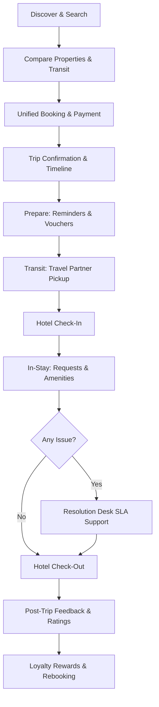
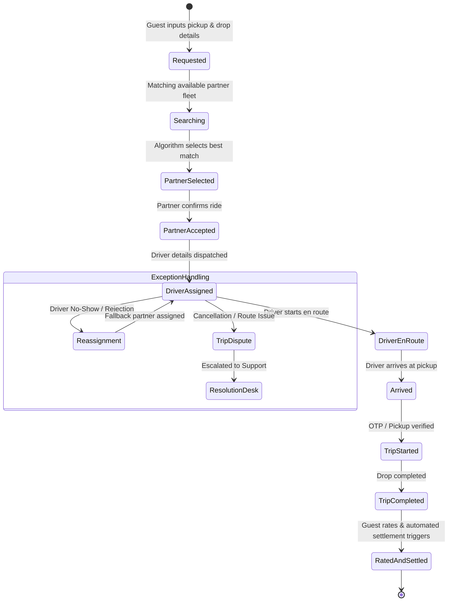
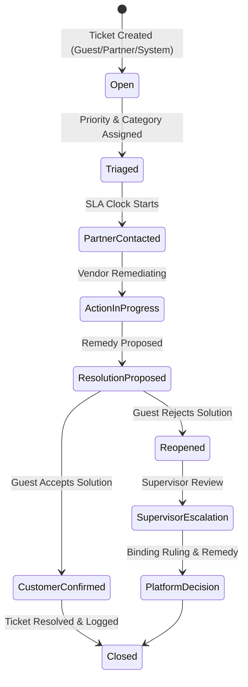
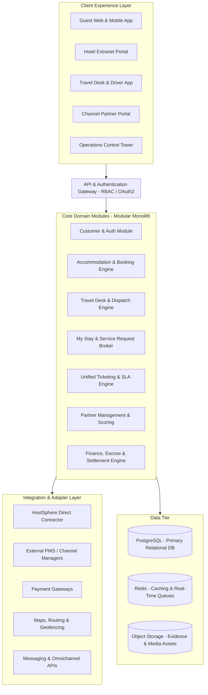
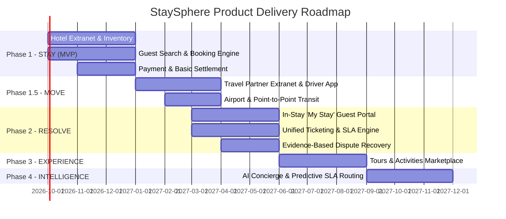

# Product Requirements Document (PRD)

# STAYSPHERE
### Hospitality Marketplace & Guest Journey Platform
**Document Version:** 3.0  
**Company:** Cybelinx  
**Product:** StaySphere  
**Category:** Hospitality Marketplace & Guest Journey Platform  
**Target Ecosystem:** Guests • Hotels • Travel Partners • Channel Partners • Operations  
**Core Brand Promise:** *Stay. Move. Experience. We’ve Got You Covered.*  

---

## Table of Contents
1. [Executive Summary](#1-executive-summary)
2. [Strategic Positioning & HostSphere Synergy](#2-strategic-positioning--hostsphere-synergy)
3. [Vision, Mission & Core Philosophy](#3-vision-mission--core-philosophy)
4. [Ecosystem Actors & Personas](#4-ecosystem-actors--personas)
5. [End-to-End Guest & Partner Journeys](#5-end-to-end-guest--partner-journeys)
6. [Core Functional Modules & Requirements](#6-core-functional-modules--requirements)
   - 6.1 [Property Marketplace & Booking Engine (STAY)](#61-property-marketplace--booking-engine-stay)
   - 6.2 [Travel Desk & Mobility Marketplace (MOVE)](#62-travel-desk--mobility-marketplace-move)
   - 6.3 [In-Stay Guest Management & Hotel Services](#63-in-stay-guest-management--hotel-services)
   - 6.4 [Resolution Desk & SLA Engine (RESOLVE)](#64-resolution-desk--sla-engine-resolve)
   - 6.5 [Operations Control Tower & Partner Management](#65-operations-control-tower--partner-management)
   - 6.6 [Trust, Safety & Marketplace Ranking](#66-trust-safety--marketplace-ranking)
   - 6.7 [Finance, Commission & Settlement Engine](#67-finance-commission--settlement-engine)
   - 6.8 [Content Management & Notifications](#68-content-management--notifications)
   - 6.9 [Future Phase: Experience Marketplace](#69-future-phase-experience-marketplace)
7. [Technical Architecture & Integrations](#7-technical-architecture--integrations)
   - 7.1 [Architectural Approach: Modular Monolith](#71-architectural-approach-modular-monolith)
   - 7.2 [HostSphere & External PMS Integration Layer](#72-hostsphere--external-pms-integration-layer)
   - 7.3 [Core Domain Data Model](#73-core-domain-data-model)
   - 7.4 [Security, Compliance & RBAC](#74-security-compliance--rbac)
8. [Phased Implementation Roadmap](#8-phased-implementation-roadmap)
9. [Metrics & Success Criteria](#9-metrics--success-criteria)

---

# 1. Executive Summary

**StaySphere** is a customer-centric hospitality marketplace designed to connect **Guests, Hotels, and Travel Partners** through a unified, trusted platform. 

StaySphere is not designed to replace a hotel's internal Property Management System (PMS), nor is it simply another standard Online Travel Agency (OTA). Rather, it redefines the hospitality experience by managing the complete guest journey lifecycle before, during, and after a stay.

```
Better Booking + Better Coordination + Better In-Stay Service + Better Resolution
```

### Core Value Proposition by Participant
* **Guest:** Discover and book verified accommodations and seamless transit with guaranteed support and dispute resolution.
* **Hotel Partner:** Capture high-intent, qualified bookings, improve occupancy, streamline guest requests, and build lasting direct relationships.
* **Travel Partner:** Access steady, predictable trip demand with transparent commissions and automated settlement.
* **StaySphere Platform:** Act as the single orchestrator of the end-to-end journey, taking accountability whenever issues arise.

---

# 2. Strategic Positioning & HostSphere Synergy

Cybelinx maintains a dual-product hospitality ecosystem where **HostSphere** and **StaySphere** serve complementary, non-overlapping functions:

```
┌─────────────────────────────────────────────────────────┐
│                        CYBELINX                         │
└────────────────────────────┬────────────────────────────┘
                             │
        ┌────────────────────┴────────────────────┐
        ▼                                         ▼
┌───────────────────────────┐         ┌───────────────────────────┐
│        HOSTSPHERE         │         │        STAYSPHERE         │
│  B2B Operations Platform  │         │ B2C/B2B2C Journey Market  │
│  "Run your property"      │         │ "Own your journey"        │
└───────────────────────────┘         └───────────────────────────┘
```

### Comparison Matrix

| Dimension | HostSphere (B2B) | StaySphere (B2C / B2B2C) |
| :--- | :--- | :--- |
| **Primary Audience** | Hotel Operators & Internal Staff | Guests, Hotels, Travel & Channel Partners |
| **Strategic Focus** | Internal Property Operations | Complete Customer Journey Lifecycle |
| **Core Mantra** | *"Run your property."* | *"Own your journey."* |
| **Reservations** | Manages room allocations & folio billing | Acquires demand & facilitates multi-party booking |
| **Housekeeping & Ops** | Staff dispatch, inventory & task scheduling | Exposes guest-facing service request interface |
| **Transportation** | Non-core / External | **Core first-class module (Travel Desk)** |
| **Channel Partners** | Non-core | **Core acquisition & distribution engine** |
| **Issue Resolution** | Internal department ticketing | **Cross-party SLA-driven Resolution Desk** |
| **Financial Settle** | Operational ledger & folio billing | **Multi-vendor commission & payout engine** |
| **Relationship Scope** | Hotel-owned internal operations | **StaySphere-orchestrated holistic journey** |

---

# 3. Vision, Mission & Core Philosophy

### Vision
> *To become the most trusted platform for discovering, booking, and managing a hospitality journey — creating superior business outcomes for guests, hotels, and travel partners.*

### Mission
> *To make hospitality transactions and journeys easier, more transparent, more reliable, more responsive, and accountable for every participant.*

### Core Principle: *"The Booking Is Not the End."*
Traditional OTAs stop at booking confirmation. StaySphere manages the full lifecycle:
```
Discover ➔ Book ➔ Prepare ➔ Travel ➔ Check-In ➔ Stay ➔ Service ➔ Resolve ➔ Check-Out ➔ Feedback ➔ Return
```

### The Win-Win-Win-Win Business Model
```
                             ┌──────────────┐
                             │  STAYSPHERE  │
                             │  (Platform)  │
                             └──────┬───────┘
                     ┌──────────────┼──────────────┐
                     ▼              ▼              ▼
              ┌────────────┐ ┌────────────┐ ┌─────────────┐
              │   GUESTS   │ │   HOTELS   │ │   TRAVEL    │
              └────────────┘ └────────────┘ └─────────────┘
```

* **Guest Wins:** Curated choices, verified property information, reliable transport, instant in-stay service requests, and guaranteed issue resolution.
* **Hotel Wins:** Incremental demand, qualified guests, streamlined service operations, structured feedback, and lower dispute overhead.
* **Travel Partner Wins:** High-intent transfer demand, route utilization, fair commission rates, and on-time automated settlement.
* **StaySphere Wins:** Dual-stream transaction commissions, partner retention, network expansion, and long-term brand equity.

---

# 4. Ecosystem Actors & Personas

| Actor | Role & Objective | Key Capabilities |
| :--- | :--- | :--- |
| **Guest / Customer** | Discover, book, travel, stay, request services, and review. | Search, filters, unified booking, trip timeline (`My Trip`), in-stay portal (`My Stay`), issue escalation, feedback. |
| **Hotel Partner** | List inventory, receive bookings, manage rates, fulfill guest service requests. | Business verification, room/rate management, availability calendar, guest messaging, service ticket fulfillment, analytics. |
| **Travel Partner** | Provide reliable ground transportation (airport, outstation, local cabs). | Fleet & driver onboarding, route & pricing configuration, dispatch acceptance, trip status updates, settlement tracking. |
| **Channel Partner** | Distribute inventory, bring corporate/retail demand, manage group bookings. | Onboarding portal, referral & affiliate tracking, co-branded booking, commission ledger, performance analytics. |
| **Resolution Desk** | Own, mediate, and resolve customer and partner grievances under SLAs. | Unified ticket queue, multi-party mediation, service recovery authorization, penalty/refund processing. |
| **Platform Ops (Control Tower)** | Oversee marketplace health, governance, trust & safety, financial settlement. | Real-time monitoring dashboard, audit logs, partner verification, dispute intervention, settlement execution. |

---

# 5. End-to-End Guest & Partner Journeys

### 5.1 The Complete Guest Journey Lifecycle



### 5.2 Travel Desk Booking & Dispatch Lifecycle



---

# 6. Core Functional Modules & Requirements

## 6.1 Property Marketplace & Booking Engine (STAY)

### Accommodation Categories
* **Initial Launch:** Hotels, Resorts, Serviced Apartments, Apartment Rentals.
* **Future Expansion:** Villas, Boutique Stays, Homestays, Long-Stay Accommodations.

### Functional Requirements
* **Discovery & Search Engine:** Multi-parameter search (destination, dates, guest count, room configuration, amenity filters, price range, distance to points of interest).
* **Inventory & Rate Plans:** Support for Flexible, Non-Refundable, Breakfast-Inclusive, Corporate, and Promotional rate plans with configurable tax structures.
* **Dynamic Cart & Checkout:** Real-time inventory lock during payment processing, instant booking confirmation via SMS/Email/WhatsApp, and multi-currency payment gateway support.
* **Modification & Cancellation:** Self-service modification and cancellation workflows enforcing property-level cancellation policies and instant refund calculations.
* **`My Trip` Dashboard:** Single timeline summarizing stay reservations, transportation legs, vouchers, check-in instructions, and billing invoices.

---

## 6.2 Travel Desk & Mobility Marketplace (MOVE)

StaySphere operates an **asset-light travel marketplace**, connecting verified local transport operators with guest transit requirements.

### Service Offerings
1. **Airport & Railway Transfers:** Fixed-schedule, flight/train-tracked pickup and drop services.
2. **Local City Cabs:** Point-to-point and hourly city rentals.
3. **Full-Day / Multi-Day Cabs:** Dedicated chauffeur-driven vehicles for sightseeing.
4. **Outstation Transportation:** Inter-city one-way and round-trip transfers.

### Partner, Driver & Vehicle Management Requirements

```
┌─────────────────────────────────────────────────────────────────┐
│                      TRAVEL DESK SYSTEM                         │
├────────────────────┬────────────────────┬───────────────────────┤
│  Partner Module    │   Driver Module    │    Vehicle Module     │
├────────────────────┼────────────────────┼───────────────────────┤
│ • Verification/KYC │ • Background Check │ • Registration & RC   │
│ • Service Zones    │ • Commercial DL    │ • Commercial Permit   │
│ • Rate Tariffs     │ • Availability App │ • Fitness Certificate │
│ • Performance/SLA  │ • In-App Nav/Trip  │ • Comprehensive Ins.  │
│ • Payouts & Dues   │ • SOS / Emergency  │ • Vehicle Class/Specs │
└────────────────────┴────────────────────┴───────────────────────┘
```

---

## 6.3 In-Stay Guest Management & Hotel Services

The **`My Stay`** module bridges the gap between check-in and check-out, converting StaySphere into a live in-stay companion.

```
                             ┌─────────────────┐
                             │ MY STAY PORTAL  │
                             └────────┬────────┘
             ┌────────────────────────┼────────────────────────┐
             ▼                        ▼                        ▼
     ┌───────────────┐        ┌───────────────┐        ┌───────────────┐
     │ Housekeeping  │        │ Dining & F&B  │        │  Maintenance  │
     │ • Fresh Towels│        │ • In-Room F&B │        │ • AC / HVAC   │
     │ • Room Clean  │        │ • Restaurant  │        │ • Wi-Fi / TV  │
     │ • Laundry Req │        │ • Table Book  │        │ • Plumbing    │
     └───────────────┘        └───────────────┘        └───────────────┘
```

### Operational Workflow
1. Guest submits a digital service request via `My Stay`.
2. Request is routed directly to the hotel's front desk dashboard / HostSphere integration.
3. **Automated Escalation Rule:** If a hotel fails to acknowledge or resolve a request within the configured SLA window (e.g., 20 minutes for housekeeping), the request automatically escalates to the **StaySphere Resolution Desk**.

---

## 6.4 Resolution Desk & SLA Engine (RESOLVE)

The **Resolution Desk** is StaySphere’s primary competitive moat. Unlike legacy platforms, StaySphere actively owns and resolves issues across the entire ecosystem.

```
Customer Issue ➔ StaySphere Resolution Desk ➔ Dedicated Vendor Mediation ➔ Fair Resolution
```

### Ticket Lifecycle Workflow



### Configurable SLA Escalation Grid

| Category | Priority | Initial Response SLA | Escalation Threshold | Target Resolution Time |
| :--- | :--- | :--- | :--- | :--- |
| **Transit: Driver No-Show** | P0 - Critical | **5 minutes** | **10 minutes** | **15 mins** (Auto-Reassignment) |
| **Check-In: Room Unavailable / Denied** | P0 - Critical | **10 minutes** | **20 minutes** | **45 mins** (Relocation / Upgrade) |
| **In-Stay: Essential Maintenance (AC/Water)** | P1 - High | **15 minutes** | **30 minutes** | **60 mins** (Repair or Room Swap) |
| **Billing / Payment Discrepancy** | P2 - Medium | **2 hours** | **6 hours** | **24 hours** |
| **General Query / Service Request** | P3 - Low | **4 hours** | **12 hours** | **48 hours** |

### Evidence-Based Resolution Framework
* **Guest Evidence:** Upload photos, audio, videos, speed test screenshots, and geo-tagged incident logs.
* **Partner Evidence:** Hotel access logs, front desk notes, driver GPS tracks, and timestamped dispatch records.
* **Service Recovery Toolkit:**
  * Instant room re-allocation or upgrade authorization.
  * Rapid replacement vehicle dispatch.
  * Partial/full refunds, platform travel credits, or goodwill discount vouchers.
  * Partner penalty assignment for SLA breach / negligence.

---

## 6.5 Operations Control Tower & Partner Management

### Control Tower Dashboard
The Central Operations Command monitors real-time ecosystem health:
* **Live KPIs:** Active Stays, Ongoing Trips, Gross Booking Value (GBV), Open Support Tickets.
* **Risk & Alert Triggers:** Imminent SLA breaches, high driver cancellation rates, hotel overbooking alerts, payment gateway downtime.
* **Financial Ledger:** Real-time settlement queues, pending refunds, credit holds.

### Partner Lifecycle & Success
```
Register ➔ Verify Documents ➔ Onboard & Train ➔ Activate ➔ Monitor Quality ➔ Retain & Grow
```
* **Partner Scorecard Metrics:** Acceptance rate, fulfillment rate, review score, SLA adherence, dispute frequency.

---

## 6.6 Trust, Safety & Marketplace Ranking

### Trust Scoring Engine

| Actor | Evaluation Criteria |
| :--- | :--- |
| **Hotel Partner** | Booking fulfillment accuracy, guest satisfaction score, maintenance complaint frequency, check-in dispute rate. |
| **Travel Partner** | On-time arrival rate, trip completion percentage, vehicle condition score, customer safety rating. |
| **Guest / Customer** | Verified identity/KYC status, booking fulfillment history, no-show rate, dispute validity score. |

### Marketplace Ranking Principles
Marketplace search ranking is calculated objectively via a weighted algorithm:
$$\text{Rank Score} = w_1(\text{Quality \& Rating}) + w_2(\text{Price/Value}) + w_3(\text{Trust Score}) + w_4(\text{Response SLA}) + w_5(\text{Location Relevance})$$

> [!IMPORTANT]
> **Commission rate is explicitly prohibited from being a primary search ranking factor.** Ranking integrity is fundamental to building long-term consumer trust.

---

## 6.7 Finance, Commission & Settlement Engine

StaySphere provides split-billing and multi-vendor escrow management.

```
                               ┌───────────────────┐
                               │  GUEST PAYMENT    │
                               └─────────┬─────────┘
                                         │
                 ┌───────────────────────┴───────────────────────┐
                 ▼                                               ▼
      ┌─────────────────────┐                         ┌─────────────────────┐
      │  HOTEL TRANSACTION  │                         │ TRAVEL TRANSACTION  │
      │  Total Paid: ₹10,000 │                         │ Total Paid: ₹2,000  │
      ├─────────────────────┤                         ├─────────────────────┤
      │ StaySphere Fee: ₹1,500│                       │ StaySphere Fee: ₹300│
      │ Hotel Payout:   ₹8,500│                       │ Driver Payout: ₹1,700│
      └─────────────────────┘                         └─────────────────────┘
```

### Financial Capabilities
* Automated split payments at checkout.
* Configurable commission rules per partner contract and property class.
* Automated dispute holdbacks, penalty deductions, and refund settlements.
* Tax compliance management (GST/TDS withholding and monthly tax invoicing).

---

## 6.8 Content Management & Notifications

### Content Management System (CMS)
* Centralized asset repository for verified high-resolution photography, 360° virtual room tours, localized city guides, and amenities metadata.
* Multi-stage content approval workflow: `Draft ➔ Internal Review ➔ Verification Approved ➔ Published ➔ Archived`.

### Omnichannel Notification Engine
* **Delivery Channels:** Push Notifications, SMS, Email, WhatsApp Business API.
* **Transactional Triggers:** Instant booking confirmation, driver dispatch/arrival tracking, check-in reminders, ticket status updates, settlement receipts.

---

## 6.9 Future Phase: Experience Marketplace

* Planned as a post-MVP expansion module.
* Enables local operators to list guided tours, adventure sports, culinary tastings, cultural excursions, and attraction tickets directly integrated into the guest’s `My Trip` timeline.

---

# 7. Technical Architecture & Integrations

## 7.1 Architectural Approach: Modular Monolith

To maximize initial development speed and simplify transactional consistency across multi-party bookings, StaySphere will launch as a **Modular Monolith** using cleanly isolated domain boundaries.



---

## 7.2 HostSphere & External PMS Integration Layer

StaySphere provides native integration for properties running **HostSphere PMS**, while offering robust API adapters for third-party systems.

```
                        STAYSPHERE CORE
                               │
                    ┌──────────┴──────────┐
                    │  PMS ADAPTER LAYER  │
                    └──────────┬──────────┘
             ┌─────────────────┴─────────────────┐
             ▼                                   ▼
    ┌─────────────────┐                 ┌─────────────────┐
    │   HOSTSPHERE    │                 │  EXTERNAL PMS / │
    │ Native Connector│                 │ CHANNEL MANAGER │
    └─────────────────┘                 └─────────────────┘
```

> [!NOTE]
> **Independence Principle:** StaySphere is fully functional as a standalone extranet platform. Hotels do not require HostSphere to list rooms, receive bookings, or fulfill guest service requests.

---

## 7.3 Core Domain Data Model

```
┌─────────────────┐       ┌─────────────────┐       ┌─────────────────┐
│     Account     │──────<│   GuestProfile  │──────<│     Booking     │
└─────────────────┘       └─────────────────┘       └────────┬────────┘
                                                             │
            ┌────────────────────────────────────────────────┼─────────────────┐
            │                                                │                 │
            ▼                                                ▼                 ▼
┌──────────────────────┐                         ┌──────────────────────┐ ┌──────────────┐
│     HotelBooking     │                         │    TravelBooking     │ │    Ticket    │
├──────────────────────┤                         ├──────────────────────┤ ├──────────────┤
│ • property_id        │                         │ • travel_partner_id  │ │ • ticket_id  │
│ • room_type_id       │                         │ • driver_id          │ │ • category   │
│ • check_in / out     │                         │ • vehicle_id         │ │ • priority   │
│ • rate_plan_id       │                         │ • pickup_lat_lng     │ │ • sla_status │
│ • service_requests[] │                         │ • drop_lat_lng       │ │ • evidence[] │
└──────────────────────┘                         └──────────────────────┘ └──────────────┘
```

---

## 7.4 Security, Compliance & RBAC

* **Role-Based Access Control (RBAC):** Strict permission segregation across Guest, Hotel Manager, Front Desk, Driver, Channel Partner, Support Agent, and Ops SuperAdmin.
* **Data Security & Privacy:** Encryption in transit (TLS 1.3) and at rest (AES-256). Masked contact numbers between drivers and guests.
* **Regulatory Compliance:** Comprehensive verification of local commercial transport permits, hotel lodging licenses, fire compliance, and regional tax registrations prior to partner onboarding.

---

# 8. Phased Implementation Roadmap



### Phase Summary
1. **Phase 1 — STAY (MVP):** End-to-end hotel search, booking engine, guest profile, hotel extranet, basic payment processing, and core admin controls.
2. **Phase 1.5 — MOVE:** Travel partner onboarding, fleet/driver registry, airport & city cab dispatch, dynamic fare calculation, and trip tracking.
3. **Phase 2 — RESOLVE:** `My Stay` guest service ordering, SLA engine, Resolution Desk console, automated escalation triggers, and evidence-based refund workflows.
4. **Phase 3 — EXPERIENCE:** Local activities, attractions, sightseeing, and destination tour packages.
5. **Phase 4 — INTELLIGENCE:** AI trip concierge, smart service routing, automated anomaly detection, and partner performance forecasting.

---

# 9. Metrics & Success Criteria

### North-Star Metric: Successful Journey Rate (SJR)
$$\text{SJR} = \frac{\text{Journeys Completed Without Unresolved Critical Escalation}}{\text{Total Booked Journeys}} \times 100$$

### Key Performance Indicators (KPIs)

```
┌────────────────────────────────────────────────────────────────────────────────┐
│                           STAYSPHERE KPI FRAMEWORK                             │
├────────────────────┬────────────────────┬──────────────────────────────────────┤
│ Stakeholder        │ Metric             │ Target / Benchmark                   │
├────────────────────┼────────────────────┼──────────────────────────────────────┤
│ Guest              │ Search-to-Book CVR │ ≥ 3.2%                               │
│                    │ Journey CSAT / NPS │ CSAT ≥ 4.6 / 5.0, NPS ≥ +55          │
│                    │ Resolution Speed   │ P0 issues resolved in < 30 mins      │
│                    │ Repeat Booking Rate│ ≥ 28% within 12 months               │
├────────────────────┼────────────────────┼──────────────────────────────────────┤
│ Hotel Partner      │ Occupancy Boost    │ +15-25% incremental occupancy        │
│                    │ Request SLA Comp.  │ ≥ 94% on-time service fulfillment    │
│                    │ Direct Dispute %   │ < 1.5% of total bookings             │
├────────────────────┼────────────────────┼──────────────────────────────────────┤
│ Travel Partner     │ Trip Fulfillment   │ ≥ 98.5% completion rate              │
│                    │ On-Time Arrival    │ ≥ 95% within 5 mins of schedule      │
│                    │ Partner Retention  │ ≥ 90% active quarterly retention     │
├────────────────────┼────────────────────┼──────────────────────────────────────┤
│ Platform Health    │ Gross Margin       │ 12-16% net blended take rate         │
│                    │ P0 SLA Breaches    │ < 0.2% of total ecosystem journeys   │
│                    │ SJR Benchmark      │ ≥ 97.5%                              │
└────────────────────┴────────────────────┴──────────────────────────────────────┘
```

---

# 10. Product Mantra & Brand Commitment

```
┌─────────────────────────────────────────────────────────┐
│                       STAYSPHERE                        │
│   Stay. Move. Experience. We've Got You Covered.        │
├─────────────────────────────────────────────────────────┤
│  STAY        Find and book verified accommodation       │
│  MOVE        Arrange reliable, punctual transportation  │
│  EXPERIENCE  Discover and enjoy the destination        │
│  RESOLVE     Guaranteed support when things go wrong    │
└─────────────────────────────────────────────────────────┘
```
**One journey. One platform. Better service for everyone.**
